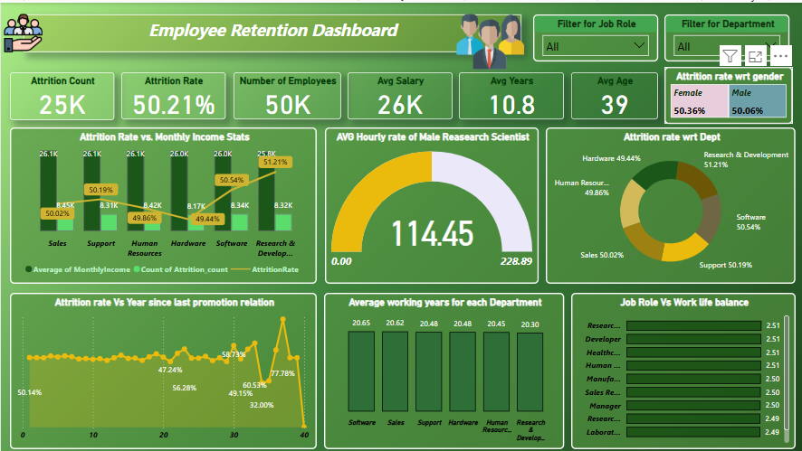

# 👩‍💼 HR Analytics Dashboard – Data-Driven Decisions for Smarter HR

Welcome to our **HR Analytics Dashboard** repository – a collaborative project designed to help HR teams **understand, analyze, and reduce employee attrition** through powerful data visualization and insights.

We used a blend of tools – **Power BI, Tableau, Excel, and SQL** – to turn raw HR data into actionable insights that can transform workforce strategy.

---

## 📸 Dashboard Preview

---

## 🔧 Tools & My Contribution

| Tool       | Purpose                                               | Contributor            |
|------------|--------------------------------------------------------|-------------------------|
| **Power BI**   | Built the main interactive dashboard to analyze attrition trends | 👉 **My role** – design, visuals, interactivity,kpis|
| **Tableau**    | Supported additional insights & visualization validation         | 👉 **My role** – insights comparison & styling |
| **Excel**      | Data cleaning, preprocessing, and EDA                        | Team contribution       |
| **SQL**        | Data validation and transformation queries               | Team contribution       |

> I was primarily responsible for **designing, building, and optimizing** the dashboards in **Power BI and Tableau** to ensure insights were clear, impactful, and user-friendly.

---

## 🧠 The Use Case: Tackling High Employee Attrition

### 🆘 Problem
The HR team of a 50K+ employee organization was struggling with **high attrition (50.21%)**. They lacked clarity on:

- Which departments were most affected  
- Whether salary or promotion history was driving resignations  
- How work-life balance played a role  
- If there were gender-based attrition trends  

---

### 🚀 Our Solution
We created an **interactive HR analytics dashboard** that broke down attrition by department, gender, salary, work-life balance, and more. Our goal was to empower HR to make **data-driven decisions** – not guesses.

---

## 🔍 Key Insights from the Dashboard

1. **📉 High-Risk Departments:**  
   - *Research & Development* and *Human Resources* topped the attrition chart (over 50%).

2. **🧘 Work-Life Balance Matters:**  
   - Employees in roles with better work-life balance left less frequently.

3. **💰 Salary ≠ Retention:**  
   - Higher pay didn't guarantee lower attrition – deeper issues were at play.

4. **📈 Promotions = Loyalty:**  
   - Attrition peaked around the 40-month mark without a promotion.

5. **⚖️ Gender Insight:**  
   - No significant difference in male vs. female attrition rates (almost 50% for both).

---

## ✅ Impact: What This Solved

- **Focus Where It Matters:** HR knew where to intervene – specific roles and departments.
- **Proactive Retention:** Mentorship and growth programs launched for employees at risk.
- **Leadership Backing:** Clear visuals made it easier to present to upper management.
- **Smarter Hiring Strategy:** Better forecasting for attrition-based role backfills.

---

## 🧑‍🤝‍🧑 Teamwork Wins

This was a **team project**, and we worked together across different tools and roles. I personally led the **Power BI** and **Tableau** development side – ensuring the visuals weren’t just pretty, but practical and packed with insight.

---

## 🔗 Connect with Me

Got feedback? Interested in collaborating?  
Reach out to me on **[LinkedIn](https://www.linkedin.com/in/khushi-vishwakarma-040239258/)** – I’d love to chat!

